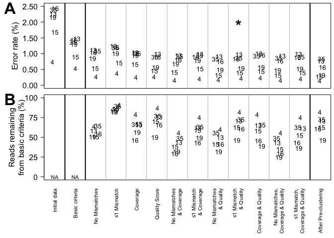
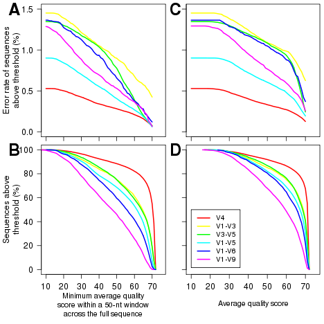
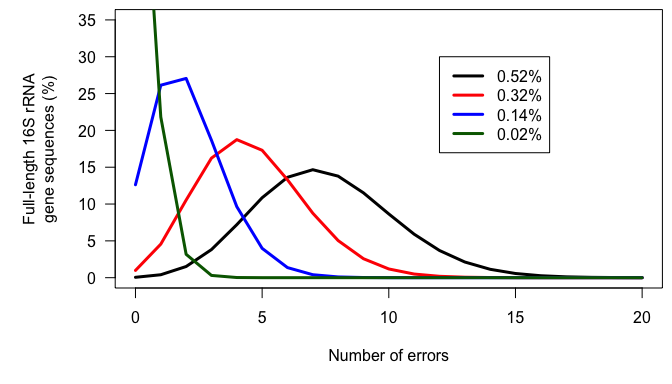

### ToDo:
* Finish Discussion
* Add data for Table 1
* Insert references
* Abstract

# Sequencing 16S rRNA gene fragments using the PacBio SMRT DNA sequencing system

**Running title:** 16S rRNA genes sequencing with PacBio

**December 16, 2014**

**Authors:** Patrick D. Schloss^1#^, Sarah L. Westcott^1^, Matthew L. Jenior^1^,
and Sarah K. Highlander^2^

\* Correspondence:	pschloss@umich.edu
734.647.5801
Department of Microbiology and Immunology
University of Michigan
5618 Medical Sciences II
1500 W. Medical Center Dr.
Ann Arbor, MI  48109

1	Department of Microbiology and Immunology, 1500 W. Medical Center, University

of Michigan, Ann Arbor, MI 48109
2	J Craig Venter Institute, 4120 Torrey Pines Road, La Jolla, CA 92307

## Abstract

### Keywords
Microbial ecology, bioinformatics, sequencing error

## Introduction
The advent of so-called next generations sequencing technologies have introduced
considerable advances in the field of microbial ecology. Clone-based Sanger
sequencing of the 16S rRNA gene has largely been replaced by various platforms
produced by 454/Roche [ref], Illumina [ref], and IonTorrent [ref]. It was once
common to sequence fewer than 100 16S rRNA gene sequence from several samples
using the Sanger approach. Now it is common to generate thousands of sequences
from each of several hundred samples [ref]. This advance in throughput has come
at the cost of read length. Sanger sequencing regularly generated 800 nt per
read and because the DNA was cloned, it was possible to obtain multiple reads
per fragment to yield a full-length sequence [ref]. At a cost of approximately
$8 (US) per sequencing read, most researchers have effectively decided that
full-length sequences are not worth the increased cost relative to the cost of
the next-generation approaches.

Each of these sequencing platforms has been primarily created to perform genome
sequencing. When sequencing a genome, it is assumed that the same base of DNA
will be sequenced multiple times and the consensus of multiple sequence reads is
used to generate contigs. Thus, although an individual base call may have a high
error rate, the consensus sequence will have a low error rate. To sequence the
16S rRNA gene researchers use conserved primers to amplify a sub-region from
within the gene that is isolated from many organisms. Because of the fragments
are not cloned, it is not possible to obtain high sequence coverage from the
same DNA molecule using these platforms. Thus, to reduce sequencing error rates
it has become imperative to develop sequence curation and denoising algorithms.
There has been a tradeoff between read length, number of reads per sample, and
the error rate. For instance, we recently demonstrated that using the Illumina
MiSeq and the 454 Roche Titanium platforms the raw error rate varies between 1
and 2% [refs]. Yet, it was possible to obtain error rates below 0.02% by
adopting various denoising algorithms. However, the resulting fragments were
only 250 bp. In the case of 454 Roche Titanium, extending the length of the
fragment introduces length-based errors and in the case of the Illumina MiSeq,
increasing the length of the fragment reduces the overlap between the read pairs
reducing the ability of each read to mutually reduce the sequencing error.
Although both of these platforms enjoy widespread use in the field, the MiSeq
platform is emerging as the leader because of the ability to sequence 15-20
million fragments that can be distributed across hundreds of samples for less
than $5000 (US).

As these sequencing platforms have grown in popularity, there has been a decline
in the number of full-length 16S rRNA genes being deposited into GenBank that
could serve as references. This is particularly frustrating since the
technologies have significantly reduced our limit of detection only to identify
novel populations for which we lack full-length reference sequences. A related
problem is the perceived limitation that the short reads generated by the 454
Roche and Illumina platforms cannot be reliably classified to the genus or
species level [ref]. Previous investigators have utilized simulations to
demonstrate that increased read lengths usually increase the accuracy and
sensitivity of classification against reference databases [ref]. There is
clearly a need to develop sequencing technologies that will allow researchers to
generate high quality full-length 16S rRNA gene sequences in a high throughput
manner.

New advances in single molecule sequencing technologies, such as the platform
produced by Pacific Biosciences (PacBio), offer the opportunity to once again
obtain full-length sequence reads with a high depth of coverage from a large
number of samples. To this point, the PacBio Single Molecule, Real-Time (SMRT)
DNA Sequencing System has received limited application in the microbial ecology
research domain [ref]. The SMRT system ligates hairpin adapters (i.e. SMRTbells)
to the ends of double-stranded DNA. Although the DNA molecule is linear, it is
effectively circularized allowing the sequencing polymerase to process around
the molecule multiple times. According to Pacific Biosciences the platform is
able to generate median read lengths longer than 8 kb with the P4-C2 chemistry;
however, the single pass error rate of is 12-15%
[http://files.pacb.com/pdf/PacBio_RS_II_Brochure.pdf]. Given the circular nature
of the DNA fragment, the full read length can be used to cover the DNA fragment
multiple times resulting in a reduced error rate. Therefore, one should be able
to obtain multiple coverage of the full 16S rRNA gene at a reduced error rate.

Despite the opportunity to potentially generate high-quality full-length
sequences, the Pacific Biosciences platform has not been widely adopted for
sequencing 16S rRNA genes. Previous studies utilizing the technology have
removed reads with mismatched primers and barcodes, ambiguous base calls, and
low quality scores; however, the error rates associated with these criteria were
not reported [ref]. Others have utilized the platform without describing the
bioinformatic pipeline that was utilized [ref]. In the current study, we sought
to assess the quality of data generated by the Pacific Biosciences sequencer and
whether it could fill the need for generating high-quality, full-length sequence
data. We hypothesized that by modulating the 16S rRNA gene fragment length we
could alter the read depth and obtain reads longer than are currently available
by the 454 Roche and Illumina platforms but with the same quality. To test this
hypothesis, we developed a sequence curation pipeline that was optimized by
reducing the sequencing error rate of a mock bacterial community with known
composition. The resulting pipeline was then applied to 16S rRNA gene fragments
that were isolated from soil and human and mouse feces.

## Materials and Methods
### Community DNA
We utilized genomic DNA isolated from four communities. These same DNA extracts
were previously used to develop an Illumina MiSeq-based sequencing strategy
[ref].  Briefly, we used a “Mock Community” composed of genomic DNA from 21
bacterial isolates: *Acinetobacter baumannii* ATCC 17978, *Actinomyces
odontolyticus* ATCC 17982, *Bacillus cereus* ATCC 10987, *Bacteroides vulgatus*
ATCC 8482, *Clostridium beijerinckii* ATCC 51743, *Deinococcus radiodurans* ATCC
13939, *Enterococcus faecalis* ATCC 47077, *Escherichia coli* ATCC 70096,
*Helicobacter pylori* ATCC 700392, *Lactobacillus gasseri* ATCC 33323, *Listeria
monocytogenes* ATCC BAA-679, *Neisseria meningitidis* ATCC BAA-335,
*Porphyromonas gingivalis* ATCC 33277, *Propionibacterium acnes* DSM 16379,
*Pseudomonas aeruginosa* ATCC 47085, *Rhodobacter sphaeroides* ATCC 17023,
*Staphylococcus aureus* ATCC BAA-1718, *Staphylococcus epidermidis* ATCC 12228,
*Streptococcus agalactiae* ATCC BAA-611, *Streptococcus mutans* ATCC 700610,
*Streptococcus pneumoniae* ATCC BAA-334. The mock community DNA is available
through BEI resources (v3.1, HM-278D). Genomic DNAs from the three other
communities were obtained using the MO BIO PowerSoil DNA extraction kit. The
human and mouse fecal samples were obtained using protocols that were reviewed
and approved by the University Committee on Use and Care of Animals and the
Institutional Review Board at the University of Michigan.

### Library generation and sequencing
The DNAs were each amplified in triplicate using barcoded primers targeting the
V4, V1-V3, V3-V5, V1-V5, V1-V6, and V1-V9 (Table 1). The primers were
synthesized so that the 5’ end of the forward and reverse primers were each
tagged with a 5-nt barcode sequence to allow multiplexing of samples within a
single sequencing run. Methods describing PCR, amplicon cleanup, and pooling
were described previously [ref]. The SMRTbell adapters were ligated onto the PCR
products and sequenced at the University of Michigan DNA Sequencing Core using
the P4-C2 chemistry on a PacBio RS II SMRT DNA Sequencing System.

### Data analysis
All sequencing data were curated using mothur (v 1.34) and analyzed using the R
programming language [refs]. Several specific features were incorporated to
facilitate the analysis of PacBio sequence data. First, because non-ambiguous
base calls are assigned to Phred quality scores of zero, the consensus fastq
files were parsed so that scores of zero were interpreted as corresponding to an
ambiguous base call (i.e. N) in the fastq.info command using the pacbio=T
option. Second, because the consensus sequence can be generated in the correct
and reverse complement orientations, a checkorient option was added to the
trim.seqs command in order to identify the proper orientation. These features
were incorporated into mothur v.1.30. We identified chimeras and assessed error
rates in the mock community as described previously using the seq.error command
in mothur [refs]. Detailed methods are available as a public online repository
(http://github.com/SchlossLab/PacBio_16S) and the original data and all
derivatives can be obtained at FigShare. A standard operating procedure for
analyzing PacBio data is available on the mothur wiki
(http://www.mothur.org/wiki/PacBio_SOP).

## Results and Discussion

### The PacBio error profile

To build a sequence curation pipeline, we first needed to characterize the error
rate associated with sequencing the 16S rRNA gene. We observed a sequencing
error rate of 1.80% across the regions within
the gene that we tested. Insertions, deletions, substitutions, and ambiguous base calls
accounted for 45.3,
17.3, 35.8,
and 2.1 of
the errors, respectively. The substitution errors were equally likely and all four bases
were equally likely to cause insertion errors. Interestingly, guanines
(44.6%) and cytosines
(34.5%) were more likely to be deleted
than adenines (11.4%) or thymidines
(9.47%). When we considered the Phred
quality score of each base call, we observed a median quality score of 72
for correct base calls and scores of 22 and 20 for
substitutions and insertions, respectively (Figure 1A). Although there
was a broad distribution of quality scores with each type of base call, the errors could
largely be distinguished from the correct base calls.

### A basic sequence curation procedure

To establish a simple curation procedure, we culled any sequence that contained
an ambiguous base call, had a string of the same base repeated 9 or more times,
did not start and end at the expected alignment coordinates for that region
of the 16S rRNA gene, or that was chimeric. This reduced the experiment-wide
error rate from 1.80 to 
0.90% across the six regions we
considered. This basic procedure resulted in the removal of between
4
(V4) and 
32.2
(V1-V9)% of the
reads and the percentage of reads removed increased with the length of the
fragment (Figure 2). For each region, the number of reads removed
because of the presence of ambiguous base calls was similar to the number of
reads that were removed for not fully aligning to the correct region within the
16S rRNA gene (Table 2). The latter class of errors was
generally due to sequence truncations that could not be explained.  

### Identifying correlates of increased sequencing error

In contrast to the 454 Roche and Illumina-based platforms where the sequencing
quality decays with length, the consensus sequencing approach employed by the
PacBio sequencer is thought to generate a uniform distribution of errors. This
makes it impossible to simply trim sequences to high quality regions. Therefore,
we sought to identify characteristics within sequences that would allow us to
identify and remove those sequences with errors using three different
approaches. First, we hypothesized that errors in the barcode and primer would
be correlated with the error rate for the entire sequence. We observed a strong
relationship between the number of mismatches to the barcodes and primers and the
error rate of the rest of the sequence fragment (Figure 1B). Although
allowing no mismatches to the barcodes and primers yielded the lowest error rate,
that stringent criterion removed a large fraction of the reads from the dataset and
allowing at most one mismatch marginally increased the error rate while preserving
more sequences in the dataset (Figure 2). Second, we hypothesized
that increased sequencing coverage should yield lower error rates. We found that
once we had obtained 10-fold coverage of the fragments, the error rate did not
change appreciably (Figure 1C). When we compared the error
rates of reads with at least 10-fold coverage to those with less coverage, we
reduced the error rate by
26.5 to 29.7%
for each region except the V4 region for which the error rate was reduced by
53%. Third, based on the earlier
analysis associating errors with quality scores, we used two quality score-based
approaches for identifying reads with errors (Figure 3). We calculated the
minimum average quality score across all 50-nt window within each sequence and
we also calculated the average quality score across each sequence. We then
associated both methods of calculating the average quality score with the error
rate of the reads and the fraction of sequences that would be retained if each
threshold were selected. Using the sliding window approach we did not observe
any clear break points indicating that one quality score would be better than
another (Figure 3AB). In contrast, using the whole sequence quality score
average we observed a decrease in the error rate and the fraction of sequences
retained when the threshold was increased above 60 (Figure 3CD). When we used
this threshold, we were able to reduce the error rate by 
32.8 to 56.1%
(Figure 2A). We noted that the fraction of reads retained
decreased as the length of the fragment increased with retention of
86.9% of the V4 reads and
50.1% of the V1-V9 reads (Figure
2B). Next, we asked whether which combinations of culling reads with mismatches
to the expected barcodes and primers, less than 10-fold sequencing coverage, and
an average quality score less than 60 made the most meaningful reductions in the
error rate while preserving the most reads when implemented with the basic
curation pipeline (Figure 2B). We observed similar error rates when we required
1 or fewer mismatches to the barcodes and primers and an average quality score
above 60 as when we also required a minimum 10-fold coverage. Culling sequences
that had more than one mismatch to the barcodes and primers and those with an
average quality score less than 60 reduced the error rate to between 
0.22 and 0.97.
This procedure resulted in the removal of 
18 and 53%
of the reads (Figure 2). The remainder of this paper uses this sequence curation
approach.

### Pre-clustering sequences to further reduce sequencing noise

Previously, we implemented a pre-clustering algorithm where sequences are sorted
by their abundance in decreasing order and rare sequences are clustered with a
more abundant sequence if the rare sequences have fewer mismatches than a
defined threshold when compared to the more abundant sequence. The recommended
threshold was a 1-nt difference per 100-bp of sequence data. For example, the
threshold for 250 bp fragment from the V4 region would be 2 nt or 14 for the
1458 bp V1-V9 fragments. This approach removes residual PCR and sequencing
errors while not overwhelming the resolution needed to identify OTUs that are
based on a 3% distance threshold. Needless to say, this approach would limit
one’s ability to detect 3 nt differences between V1-V9 sequences. When we apply
this approach to our PacBio data, we observed a reduction in the error rate
between 15 (V1-V3 and V3-V5) and 44% (V1-V5).
The final error rates varied between
0.14
(V4)
and 0.83%
(V3-V5); the
full-length, V1-V9, fragments had an error rate of
0.32%
(Figure 2B). These error rates are 7-40
times higher than what we have previously observed using the Roche 454 and
Illumina MiSeq platforms (0.02%)[refs].

### Effects of error rates on OTU assignments

The sequencing error rate is known to affect the number of OTUs that are
observed [ref]. For each region, we determined that if there were no chimeras or
PCR or sequencing errors, then we would expect to find 20 OTUs. When
achieved perfect chimera removal, but allowed for PCR and sequencing errors, we
observed between 6 (V4) and 63.1
(V3-V5) extra OTUs. The range in the number of extra OTUs was largely
explained by the sequencing error rate (Pearson's R=
0.91. Next, we determined
the number of OTUs that were observed when we used UCHIME to identify chimeric sequence.
Under these more realistic conditions, we observed between 7.4 (V4) and 86.8
(V3-V5) extra OTUs. Finally, we calculated the number of OTUs in the
soil, mouse, and human samples using the same pipeline with chimera detection and removal
based on the UCHIME algorithm. Again, we found that there was a strong correlation between
the number of observed OTUs and the error rate for the
soil (R=0.62),
mouse (R=0.90),
and human samples (R=0.72). 
These results underscore the effect of sequencing error on the inflation of the number of
observed OTUs.

### Increasing sequence length improves classification

We classified all of the sequence data we generated using the naïve Bayesian
classifier using the RDP, SILVA, and greengenes reference taxonomies (Figure
4). In general, increasing the length of the region improved the
ability to assign the sequence to a genus or species. Interestingly, each of the
samples we analyzed varied in their ability to assign sequences to the depth of
genus or species and the reference database that did the best job of classifying
the sequences varied by sample type. For example, the SILVA reference did the
best for the human feces and soil samples and the RDP did the best for the mouse feces
samples. An advantage of the greengenes database is that it contains
information for 2,514 species-level lineages for 11% of the reference sequences;
the other databases only provided taxonomic data to the genus level. There was a
modest association between the length of the fragment and the
ability to classify sequences to the species-level for the human samples, there
was no such association for the mouse and soil samples. In fact, at most
4.0% of
the soil sequences and 3.8%
of the mouse sequences could be classified to a
species. These results indicate that the ability to classify sequences to the
genus or species level is a function of read length, sample type, and the
reference database.  

### Sequencing errors are not random

Above, we described that although there was no obvious bias in the substitution
or insertion rate, we did observe that guanines and cytosines were more likely
to be deleted than adenines and thymidines. This lack of randomness in the error
profile suggested that there might be a systematic non-random distribution of
the errors across the sequences. This would manifest itself by the creation of
duplicate sequences with the same error. Because we were able to obtain a large
number of reads from the mock communitie where we sequenced the V4
(N=17361), V1-V5 (N=8061 sequences), and V3-V5 (N=4854)
regions, we investigated the mock community data from these regions further. We
identified all of the sequences that had a 1-nt difference to the true sequence.
For these three regions, a majority of the sequences with 1-nt errors were only
observed once (V4: 75.6%, V1-V5:
82.8%, V3-V5:
79.8%). We found that the frequency of the
most abundant 1-nt error paralleled the number of sequences. There were two sequences
in the V4 dataset that occured 76 times, one
sequence in the V1-V5 dataset that occured 30
times, and one sequence in the V3-V5 dataset that occured
17 times. These results indicate that
reproducible errors occur with the PacBio sequencing platform and that they can be
quite frequent.

## Conclusions
The various sequencing platforms that are available to microbial ecologists are
able to fill unique needs and have their own strengths and weaknesses. For
sequencing the 16S rRNA gene, the 454 platform is able to generate a moderate
number of high-quality 500-nt sequence fragments (error rates < 0.02%) [ref] and
the MiSeq platform is able to generate a large number of high-quality 250-nt
sequence fragments (error rates < 0.02%) [ref]. The promise of the PacBio
sequencing platform was the generation of high-quality near full-length sequence
fragments. As we have shown in this study, it is possible to generate near
full-length sequences; however, the error rate associated with those reads is
considerable (i.e. 0.32%)
and requires a level of sequencing coverage that is not commonly observed in a
typical sequencing run. This results in the generation of a small number of low
quality full-length sequences. When we considered the shorter V4 region, that is
similar in length to what is sequenced by the MiSeq platform, the error rates
we observed with the PacBio platform were nearly 5-fold higher than what has
previously been reported. It appears that the promise offered by the PacBio
platform has not been realized.

The widespread adoption of the 454 and MiSeq platforms and decrease in Sanger
sequencing for sequencing the 16S rRNA gene has resulted in a decrease in the
generation of the full-length reference sequences that are needed for performing
phylogenetic analyses and designing lineage specific PCR primers and fluorescent
in situ hybridization probes. It remains to be determined whether the elevated
error rates we observed for full-length sequences are prohibitive for these
applications. We can estimate the distribution of errors assuming that the
errors follow a binomial distribution along the length of the 1,500 nt
gene with the error rate that we achieved from the V1-V9 mock community data
prior to pre-clustering the sequences, which was 
0.52% (Figure 5). Under
these conditions one would only expect 
0.04% of the
sequences to have no errors. In fact, 95% of the reads would have at least 
3 errors and 50% of the
reads would have at least 
8 errors. If the error
rate from the pre-clustered data
(0.32%) were used, then 95% of
the reads would have at least 
2 errors and 50% of the
reads would have at least 
5 errors. If it were
posible to replicate the low error rates we have previously obsereved using the
454 and Illumina MiSeq platforms, which was 0.02%, then we would expect 
74.1% of the sequences to have no errors.
In fact, 95% of the reads would have 1 or fewer
errors. Although full-length sequence data is highly desired, at this point, it
does not appear that the PacBio platform can provide the data of sufficient
quality to fill the niche of generating reference sequences.

### Remaining outline...

* Classification is dependent on quality of sequence data, length of the data, and
the quality of the database (1 paragraph)
* Conclude (1 paragraph)  
	* Critical that people begin to utilize mock communities as part of their
	  experimental design so that they can quantify their error rates. Merely
	  demonstrating one can generate sequence data is insufficient.
	* Probably not worth the effort at this point

## Acknowledgements
The Genomic DNA from Microbial Mock Community A (Even, Low Concentration, v3.1,
HM-278D) was obtained through the NIH Biodefense and Emerging Infections
Research Resources Repository, NIAID, NIH as part of the Human Microbiome
Project.

## Funding statement
This study was supported by grants from the NIH (R01HG005975, R01GM099514 and
P30DK034933 to PDS and U54HG004973 to SKH).

## References

## Tables

**Table 1. Summary of the primer pairs used to generate the 16S rRNA gene fragment fragments and the characteristics of each region.**

        Forward                Reverse                 *E. coli* coordinates^a^    Length (bp) 
------  ---------------------  ---------------------  --------------------------  -------------
V1-V9   AGRGTTTGATYMTGGCTCAG   GGYTACCTTGTTACGACTT              8-1510                1503     
V1-V6   AGRGTTTGATYMTGGCTCAG   ACRACACGAGCTGACGAC               8-1078                1071     
V1-V5   AGRGTTTGATYMTGGCTCAG   CCCGTCAATTCMTTTRAGT              8-927                  920     
V1-V3   AGRGTTTGATYMTGGCTCAG   ATTACCGCGGCTGCTGG                8-534                  527     
V3-V5   CCTACGGGAGGCAGCAG      CCCGTCAATTCMTTTRAGT             341-927                 587     
V4      GTGCCAGCMGCCGCGGTAA    GGACTACHVGGGTWTCTAAT            515-806                 292     

^a^	The coordinates where the start and end of the forward and reverse primers anneal, respectively.

**Table 2. Summary of the reasons that sequences were excluded because of the
basic sequence curation steps**

       Initial sequences (N)    Good reads (%)    Wrong start/end position (%)    Excessively long homopolymers (%)    Ambiguous base calls (%)    Sequences remaining (N\) 
----  -----------------------  ----------------  ------------------------------  -----------------------------------  --------------------------  --------------------------
v4             21841                 96.0                     2.9                                0.1                             1.5                        20974           
v13            5212                  84.0                     10.0                               0.1                             7.5                         4378           
v35            7236                  77.3                     15.6                               0.2                             11.0                        5594           
v15            14875                 79.1                     11.5                               0.2                             12.5                       11764           
v16            2220                  72.6                     11.4                               0.1                             19.4                        1611           
v19            5003                  67.8                     18.0                               0.5                             17.5                        3393           

## Figures

**Figure 1. Summary of errors in data generated using PacBio sequencing platform
to sequence various regions within the 16S rRNA gene.** Quality scores varied
with error types (A). The seqeuncing error rate of the amplified gene fragments
increased with mismatches to the barcodes and primers (B). The sequencing error
rate declined with increasd sequencing coverage; however, increasing the
sequencing depth beyond 10-fold coverage had no meaningful effect on the
sequencing error rate (C).

**Figure 2. Change in error rate (A) and the percentage of sequences that were
retained (B) when using various sequence curation methods.** The condition that
was used for downstream analyses is indicated by the star. The plotted numbers
represent the region that was sequenced. For example "15" represents the data
for the V1-V5 region.

**Figure 3. The relationship between the error rate of each region and the
composite quality scores for the sequences.** The error rates (A and C) and
percentage of sequences (B and D) were calculated for the reads that had a
composite quality score above the plotted value. The composite quality scores
were calculated by either determining the minimum value of the average quality
score wihin all 50-nt windows within each region (A and B) or by calculating
the average quality score across the entire sequence read (C and D).

**Figure 4. The percentage of unique sequences that could be classified using
taxonomy references curated from the RDP, SILVA, or greengenes for the four
types of samples that were sequenced across the six regions from the 16S rRNA
gene.** Only the greengenes taxonomy reference provided species-level
information.

**Figure 5. The percentage of V1-V9 sequences that were predicted to have
between 0 and 20 errors as a function of the error rate of the sequences.** The 
error rates were selected because they represented the error rate for the V1-V9
sequences before (0.52%) and
after (0.32%) the
pre-clustering step, the lowest observed error rate we observed (V4:
0.14%) and the error rate we 
observed previously using the 454 and MiSeq sequencing platforms. The predicted
number of errors was assumed to follow a binomial distribution.

### Figure 1

### Figure 2

### Figure 3

### Figure 4

### Figure 5

